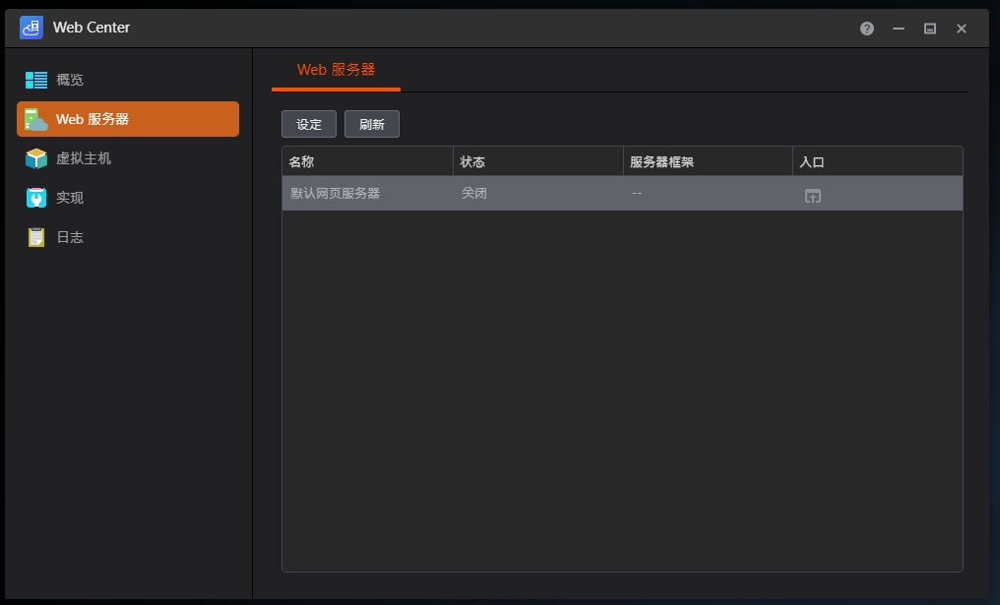

# Chapter 2: NAS System Initialization and Development Environment Configuration

After completing router configuration, we need to perform system-level configuration on the NAS device. This chapter will guide you through the necessary system settings to prepare for subsequent NFX service deployment.

## 1. Disable Web Center Service

**Important: Please ensure the Web Center service is disabled.**



### Why Disable Web Center?

Asustor NAS's Web Center service defaults to using the following ports:
- **Port 80 (HTTP)**
- **Port 443 (HTTPS)**

These ports completely conflict with the ports required by our NebulaForgeX Community services (particularly the [NFX-Edge](https://github.com/NebulaForgeX/NFX-Edge) reverse proxy service). If the Web Center service is running, reverse proxy services such as Traefik will be unable to start normally, causing the entire service stack deployment to fail.

### Steps

1. Log in to Asustor NAS's ADM (Asustor Data Master) management interface
2. Navigate to the "Services" menu
3. Find the "Web Center" service
4. Ensure the service is in "Stopped" or "Disabled" state
5. If the service is running, stop it immediately and disable auto-start

## 2. Enable SSH Service

SSH (Secure Shell) is a necessary tool for remote NAS management and command-line operations. After enabling the SSH service, you can connect to the NAS through command-line tools to perform subsequent configuration and deployment operations.


### Steps to Enable

1. In the ADM management interface, navigate to the "Services" menu
2. Find "SSH Service"
3. Enable the SSH service
4. Recommended security configuration options:
   - Change the default port (optional but recommended, avoid using port 22)
   - Disable root user direct login (recommended)
   - Enable key authentication (recommended)
   - Configure access whitelist (optional but recommended)

### Security Recommendations

- Use strong passwords or SSH key authentication
- Consider using non-standard ports to reduce automated attacks
- Regularly update the NAS system to get security patches
- Only expose SSH service to the public network when necessary (recommended to use only on internal network)

## 3. Install Required Applications

Install the following required applications through Asustor's App Center. These applications are the fundamental components for running the NFX service stack.


### Required Applications List

#### Docker Engine
- **Purpose**: Container runtime environment
- **Description**: The NFX service stack runs entirely on Docker containers, and Docker Engine is the core dependency
- **Version Requirements**: Recommended to use the latest stable version
- **Post-installation Verification**: Run `docker --version` to confirm successful installation

#### Git
- **Purpose**: Version control system
- **Description**: Used to clone NFX project repositories and manage configuration file versions
- **Post-installation Verification**: Run `git --version` to confirm successful installation

#### Entware
- **Purpose**: Package manager
- **Description**: Provides additional Linux tools and software packages for NAS, especially solving the problem of incomplete NAS systems
- **Post-installation Verification**: Run `/opt/bin/opkg --version` to confirm successful installation
- **Importance**: Entware is crucial for subsequent Bash environment configuration

### Recommended Installation Order

1. First install **Entware** (preparation for subsequent steps)
2. Then install **Git** (for project code management)
3. Finally install **Docker Engine** (core runtime environment)

## 4. Configure Bash Environment

### Problem Background

Most commercial NAS systems (including Asustor) are built on streamlined Linux systems. To reduce system size and improve performance, they typically remove some "non-essential" standard Linux tools. Among them, `/bin/bash` is a common missing item.

NAS systems usually only provide `/bin/sh` (usually dash or busybox sh). Although functionally basic, for:
- Modern SSH clients (such as Cursor, certain VS Code extensions)
- Complex script execution
- Development environment tools

a complete Bash environment is essential.

### Solution: Install Bash Using Entware

Since we have already installed the Entware package manager, we can use it to install a complete Bash shell.

### Detailed Installation Steps

#### Step 1: Establish SSH Connection

Choose the appropriate terminal tool based on your operating system:

- **Windows Users**: Use CMD, PowerShell, or Windows Terminal
- **Linux/Mac Users**: Use system Terminal

Connect to the NAS:

```bash
ssh your-username@your-nas-ip-address
```

Example:
```bash
ssh admin@192.168.1.100
```

#### Step 2: Verify Entware Installation

First, confirm that Entware is correctly installed and functioning:

```bash
/opt/bin/opkg --version
```

**Expected Output Example:**
```
opkg version 38eccbb1fd694d4798ac1baf88f9ba83d1eac616 (2024-10-16)
```

If the command cannot be executed or returns an error, please return to Step 3 to reinstall Entware.

#### Step 3: Update Package Index

Before installing any packages, it is recommended to update Entware's package index to ensure you get the latest package information:

```bash
/opt/bin/opkg update
```

This command will download the latest package list from Entware's software repository. Depending on network speed, this may take a few seconds to tens of seconds.

#### Step 4: Install Bash

Use opkg to install Bash:

```bash
/opt/bin/opkg install bash
```

The installation process will automatically download Bash and its dependencies. After installation, Bash will be installed at `/opt/bin/bash`.

#### Step 5: Verify Bash Installation

Confirm that Bash is correctly installed and can run:

```bash
/opt/bin/bash --version
```

**Expected Output Example:**
```
GNU bash, version 5.x.x(1)-release (arm-unknown-linux-gnueabih)
Copyright (C) 2020 Free Software Foundation, Inc.
License GPLv3+: GNU GPL version 3 or later <http://gnu.org/licenses/gpl.html>
```

#### Step 6: Create System-Level Symbolic Link

To allow the system to recognize Bash as the default shell and enable tools that require the `/bin/bash` path to work properly, we need to create a symbolic link:

```bash
sudo ln -s /opt/bin/bash /bin/bash
```

This command creates a symbolic link from `/bin/bash` to `/opt/bin/bash`. `sudo` is used because the `/bin` directory requires administrator privileges.

**Verify the Link:**

```bash
ls -l /bin/bash
```

You should see output similar to:
```
lrwxrwxrwx 1 root root 15 Jan  1 12:00 /bin/bash -> /opt/bin/bash
```

#### Step 7: Test Bash Environment (Optional)

You can switch to the Bash shell for testing:

```bash
/bin/bash
```

If successful, the command prompt may change. Type `exit` to exit Bash and return to the original shell.

## 5. SSH Client Configuration Notes

### Using Cursor IDE

Cursor is an AI-assisted code editor based on VS Code. If you plan to use Cursor to connect to the NAS via SSH for development:

**Requirements:**
- Must complete the above Bash installation and symbolic link creation steps
- Cursor requires the system to provide the `/bin/bash` path to function properly

**Advantages:**
- Full code editing capabilities
- AI-assisted programming
- Remote development support

### Using Visual Studio Code

If you use the standard Visual Studio Code:

**Requirements:**
- VS Code's Remote-SSH extension is less strict about `/bin/bash` requirements
- VS Code can usually connect normally even without complete Bash

**Notes:**
- VS Code is more flexible and can use the system's default shell
- However, installing Bash is still recommended to ensure scripts and tools run properly

### Using Other SSH Clients

If you use other SSH clients (such as PuTTY, Termius, SecureCRT, etc.), they are usually not affected by Bash installation, but installing Bash is still recommended because:

- Many automation scripts require a Bash environment
- Some development tools and scripts assume Bash is available
- Better script compatibility and feature support

---

## Configuration Completion Checklist

Before proceeding to the next chapter, please confirm that you have completed all of the following configurations:

- ✅ Web Center service is disabled
- ✅ SSH service is enabled and can connect normally
- ✅ Docker Engine is installed and running properly
- ✅ Git is installed
- ✅ Entware is installed
- ✅ Bash is installed and symbolic link created
- ✅ Can connect to NAS via SSH normally

**After completing all the above configurations, your NAS development environment is ready, and you can start deploying the NFX service stack!**
